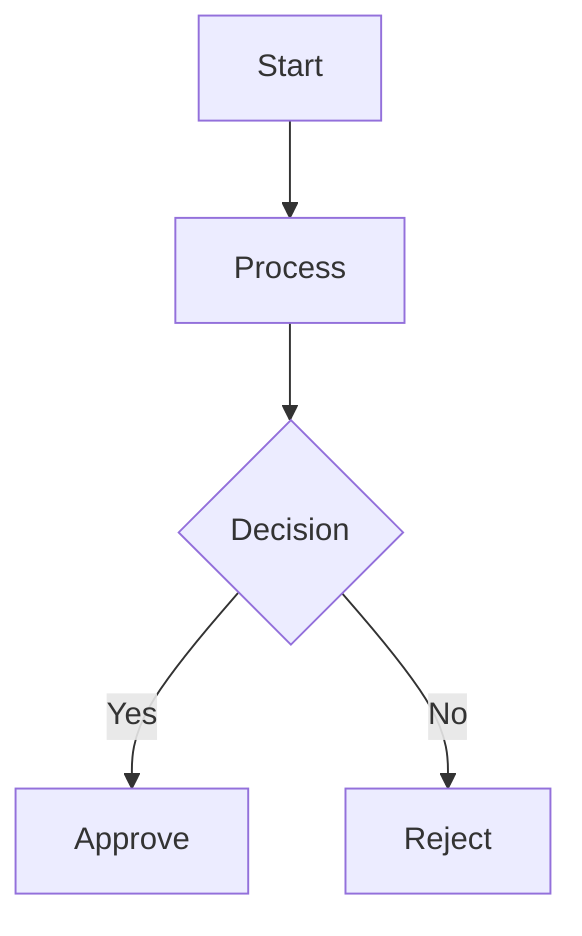

# AI Prompt Templates 🧰

My personal prompt library. Battle-tested prompts from real work, collected over time.

## Why this exists

Common pitfalls when describing business processes to AI:

- ❌ Dumping a 200+ line BPMN XML — AI gets lost in the tags
- ❌ Plain text without structure — AI misses branch conditions
- ❌ Forgetting to define roles — AI doesn't know *who* does *what*

After trial and error, the most effective approach is the **three-piece toolkit**:

> Roles → Mermaid diagram → Branch table

## Mermaid quick reference

A text-based diagramming language. Natively supported by GitHub, Notion, and Obsidian.

| Syntax | Meaning |
|--------|---------|
| `A[text]` | Rectangle node |
| `A{text}` | Diamond (decision) |
| `A --> B` | Arrow |
| `A -->|label| B` | Labeled arrow |
| `graph TD` | Top-down layout |
| `graph LR` | Left-right layout |

## Templates

| File | Description |
|------|-------------|
| [templates/workflow.md](templates/workflow.md) | Generic workflow template — fill in the blanks |
| [examples/canteen-workflow.md](examples/canteen-workflow.md) | Real-world example: canteen complaint workflow |

## How to use

1. Copy the template, fill in your roles and flow
2. Draw the Mermaid diagram (label every key branch)
3. List branch conditions in a table
4. Paste all three to Claude / GPT with: "Build this workflow"

## Related

- Luchuan · Smart Logistics — canteen management system
- [Mermaid docs](https://mermaid.js.org/)
