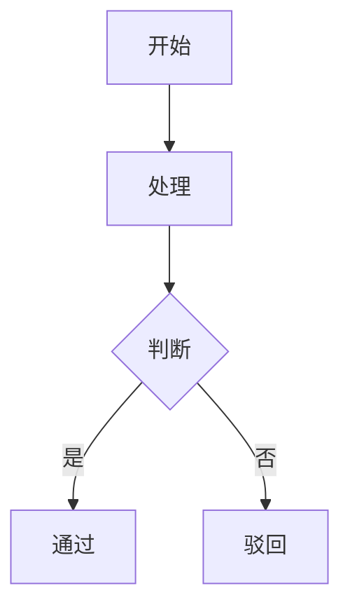

# AI Prompt Templates

给 AI 描述业务流程的提示词模板合集。

## 为什么需要这个

给 AI 描述业务流程时，常见的问题：

- ❌ 丢个 BPMN XML（200+ 行），AI 迷失在标签里
- ❌ 纯文字描述，AI 漏掉分支条件
- ❌ 没说清楚角色，AI 不知道"谁在做什么"

经过反复踩坑，最有效的方案是 **三件套**：

> 角色说明 → Mermaid 流程图 → 分支表格

## Mermaid 速查

用文字画流程图的标记语言。GitHub / Notion / Obsidian 都原生支持。

| 写法 | 意思 |
|------|------|
| `A[文字]` | 方形节点 |
| `A{文字}` | 菱形（分支判断） |
| `A --> B` | 箭头 |
| `A -->|标签| B` | 带条件的箭头 |
| `graph TD` | 从上到下 |
| `graph LR` | 从左到右 |

## 模板

| 文件 | 说明 |
|------|------|
| [templates/workflow.md](templates/workflow.md) | 通用工作流模板，填空即用 |
| [examples/canteen-workflow.md](examples/canteen-workflow.md) | 完整案例：食堂投诉工单流程 |

## 使用方法

1. 复制模板，填上你的角色和流程
2. 画 Mermaid 图（关键分支都要标注）
3. 用表格列出分支条件
4. 把三件套贴给 Claude / GPT，加上一句"请按这个流程开发"

## 相关

- 鹭川 · 智慧后勤 — 食堂管理系统
- [Mermaid 官方文档](https://mermaid.js.org/)
