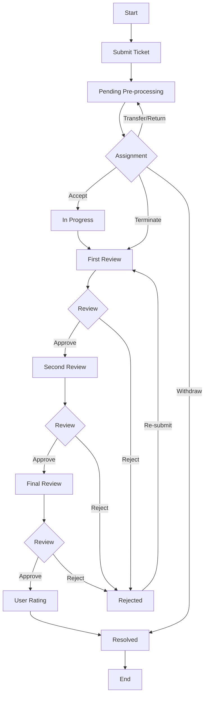

# Example: Canteen Complaint Workflow

A real workflow from the Luchuan Smart Logistics canteen management system. Source: Activiti BPMN `feedback.bpmn20.xml` (229 lines of XML).

## Roles

- **Applicant (applyuserid)**: submits complaint + final satisfaction rating
- **Pre-processor (preprocessor)**: receives ticket, initial review, assignment
- **Processor**: investigates and resolves the issue
- **Reviewer**: three-level review (First → Second → Final)

## Main Flow

## Branch Conditions

### Assignment Node (Pre-processor)

| Action | Condition | Target | Description |
|--------|-----------|--------|-------------|
| Accept | received=1 | → In Progress | Normal processing |
| Transfer | received=2 | ↩ Pending | Reassign to another pre-processor |
| Return | received=4 | ↩ Pending | Send back for more info |
| Terminate | received=3 | → First Review | Skip processing, go straight to review |
| Withdraw | received=5 | → Resolved → End | Applicant cancels complaint |

### Review Nodes (same rules for First / Second / Final)

| Result | Condition | Target | Description |
|--------|-----------|--------|-------------|
| Approve | auditSuccess=1 | → Next review / User Rating | Final review → rating |
| Reject | auditSuccess=0 | → Rejected → Re-submit → First Review | Send back to processor |

## Special Paths

- **Rejection loop**: Any review rejects → back to processor → re-submit → back to First Review
- **Withdrawal shortcut**: Withdraw at assignment → skip all processing & review → end directly
- **Termination shortcut**: Terminate at assignment → skip processing → enter review directly
