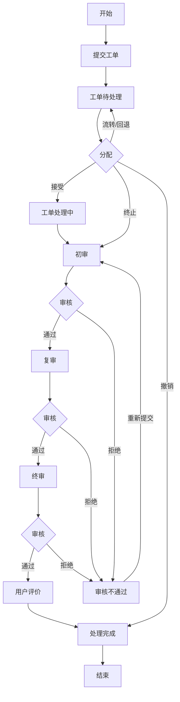

# 案例：食堂投诉工单流程

来自鹭川智慧后勤系统的真实工单流程。源文件：Activiti BPMN `feedback.bpmn20.xml`（229 行 XML）。

## 角色

- **发起人(applyuserid)**：提交投诉 + 最终评价
- **预处理人(preprocessor)**：接收工单、初步审核、分配
- **处理人(processor)**：实际解决问题
- **审核人**：三级审核（初审→复审→终审）

## 主流程

## 分支条件

### 分配节点（预处理人操作）

| 操作 | 条件 | 去向 | 说明 |
|------|------|------|------|
| 接受 | received=1 | → 工单处理中 | 正常进入处理流程 |
| 流转 | received=2 | ↩ 工单待处理 | 转交其他预处理人 |
| 回退 | received=4 | ↩ 工单待处理 | 信息不全退回补充 |
| 终止 | received=3 | → 初审 | 跳过处理，直接审核 |
| 撤销 | received=5 | → 处理完成 → 结束 | 发起人撤回投诉 |

### 审核节点（初审/复审/终审相同规则）

| 结果 | 条件 | 去向 | 说明 |
|------|------|------|------|
| 通过 | auditSuccess=1 | → 下一级 / 用户评价 | 终审通过后进入评价 |
| 拒绝 | auditSuccess=0 | → 审核不通过 → 重新提交 → 初审 | 退回处理人修改 |

## 特殊路径

- **审核不通过回路**：任意级审核拒绝 → 退回处理人 → 重新提交处理意见 → 回到初审
- **撤销快捷路径**：分配时撤回 → 跳过所有处理/审核 → 直接结束
- **终止快捷路径**：分配时终止 → 跳过处理 → 直接进入审核
